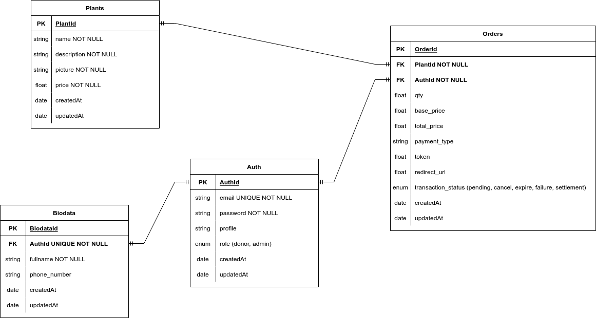

<div align="center">
  
</div>

<br>

# Tanam Backend

## About Project
Tanam is a platform that facilitates the donation of plants for reforestation purposes

## Features

There are two user in this platform: donor & admin

### Donor
- Login & Register
- List All Available Plants
- Place orders For Plant Donation
- View Order / Donation

### Admin
- Login
- List All Plants
- Create, Update And Delete plant
- List All Orders / Donation
- View Order / Donation Detail


## Tech Stacks
- Go 1.22.0
- Echo Framework
- Midtrans SDK 
- GoogleAPI SDK
- Viper
- Docker
- Docker Compose
- MySQL 
- Gorm
- Google UUID

## API Documentation
You can see the postman collection and environment inside docs directory

## ERD


## Prerequisite
Sign up for an account on https://midtrans.com/.

Create a service account and authorize it with the role of Storage Object Admin. Then, navigate to the service account in the keys section and select the ADD KEYS > CREATE NEW KEYS option. Opt for JSON as the key format. The key will be automatically downloaded to your device; keep it safe for future use.

## Setup Local
Clone this repository
```bash
git clone https://github.com/HaradaKumiko/tanam-backend
```
Navigate to the project directory:
```bash
cd tanam-backend
```
Generate a key.json file and place it in the `utils -> google` directory. This file should contain the JSON key obtained earlier from the GCP Service Accounts.

Create .env file using this command
```bash
cp .env.local .env
```
Open the .env file and edit the value

- DB_HOST= Insert your database host
- DB_USERNAME= Insert your database username
- DB_PASSWORD= Insert your database password
- DB_NAME= Insert your database Name
- CLIENT_KEY=Insert your client key from midtrans
- SERVER_KEY=Insert your server key from midtrans
- IRIS_KEY=IRIS-Insert your iris key from midtrans
- MERCHANT_ID=Insert your merchant id from midtrans

```bash
Note: add " " between your value
```


Install module using this command
```bash
go mod download
```

Running this project
```bash
go run main.go
```

Executing this seeder: you can easily initiate by visiting your browser and typing http://localhost:1323/seed


